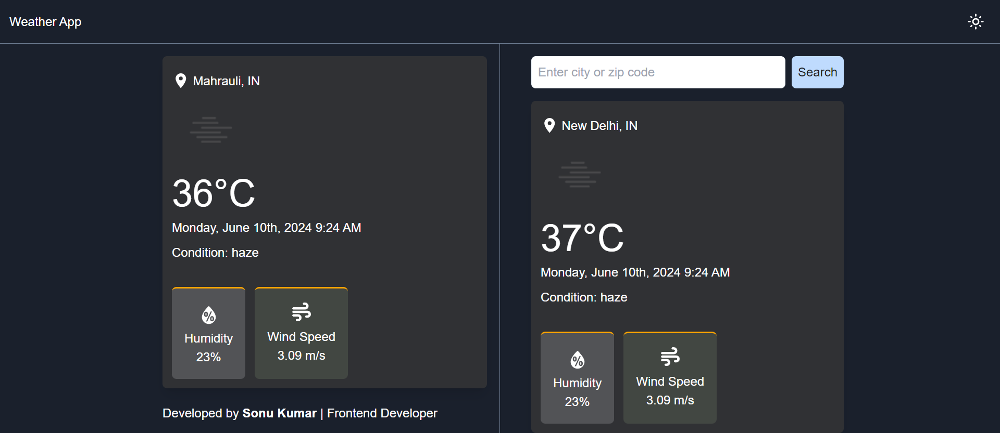

# Weather App

This is a weather application built using React and the Open Weather API.

## Features

- Display current weather information
- Search weather for other locations
- Dark mode/light mode toggle implemented
- Display weather information for multiple locations simultaneously

## How to run the application locally

Clone down this repository. You will need `node.js` and `git` installed globally on your machine.

## 🛠 Installation and Setup Instructions

1. Installation: `npm install`

2. In the project directory, you can run: `npm run dev`

Runs the app in the development mode.\
Open [http://localhost:3000](http://localhost:3000) to view it in the browser.
The page will reload if you make edits.

## Usage Instructions

Open the project folder and Navigate to `/src/components/`.  
You will find all the components used and you can edit your information accordingly.

## Technologies Used

- **React**: A JavaScript library for building user interfaces.
- **Axios**: I utilized Axios to fetch weather data from the OpenWeatherMap API, ensuring reliable and efficient data retrieval.
- **Open Weather API**: Provides weather data, including current weather, forecasts, and historical data.
- **Context API**: For state management.
- **Tailwind CSS**: A utility-first CSS framework for styling.
- **Date-fns**: For formatting dates.

View [https://splendorous-sundae-eb1e2c.netlify.app/] (live demo)

## Approach

The application is structured with a clear separation of concerns:

- **Components**: Individual components are responsible for rendering specific parts of the UI.
- **Context API**: Used for managing global state, such as the current weather data and loading states.
- **API Integration**: The application fetches weather data from the Open Weather API using async/await syntax within useEffect hooks for lifecycle management.

## Known Issues or Limitations

- **Geolocation Permissions**: If the user denies geolocation permissions, the application defaults to a predefined location. Future improvements could include a more user-friendly way to handle this scenario.
- **API Rate Limiting**: The Open Weather API has rate limiting. Exceeding the limit may result in temporary unavailability of weather data. Consider upgrading to a higher API plan if necessary.
